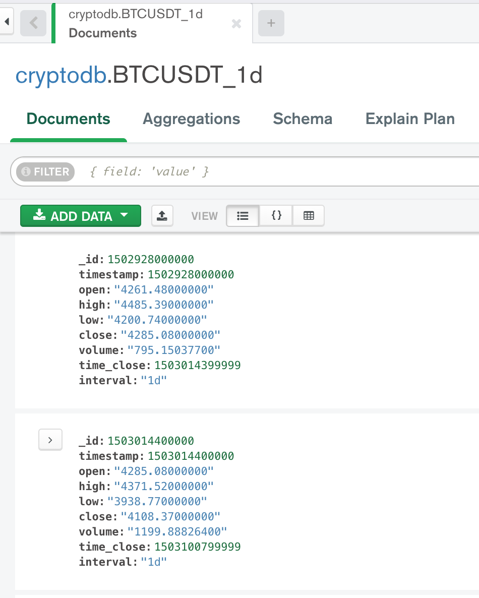
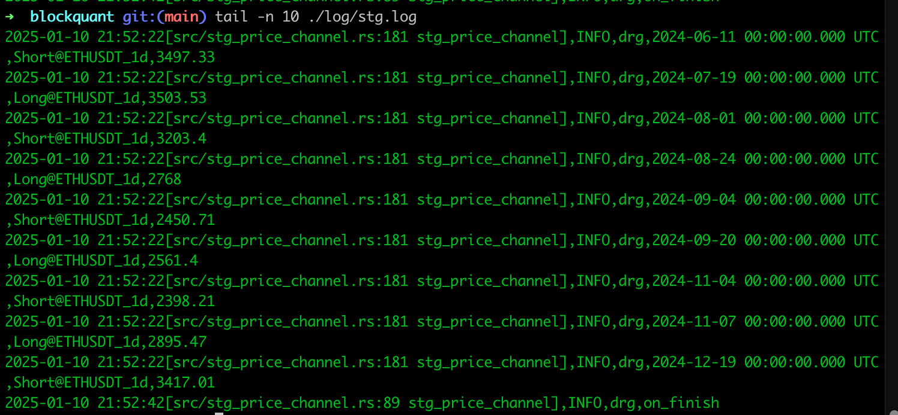

# blockquant

rust backtest crypto local mongo data, you can create your own strategy and test it.

# mongo data struct

# strategy run result

# more ...

our team just close the rust strategy project, and focus on C++ and python, maybe a few javascript.
this just as backup or lookback.
